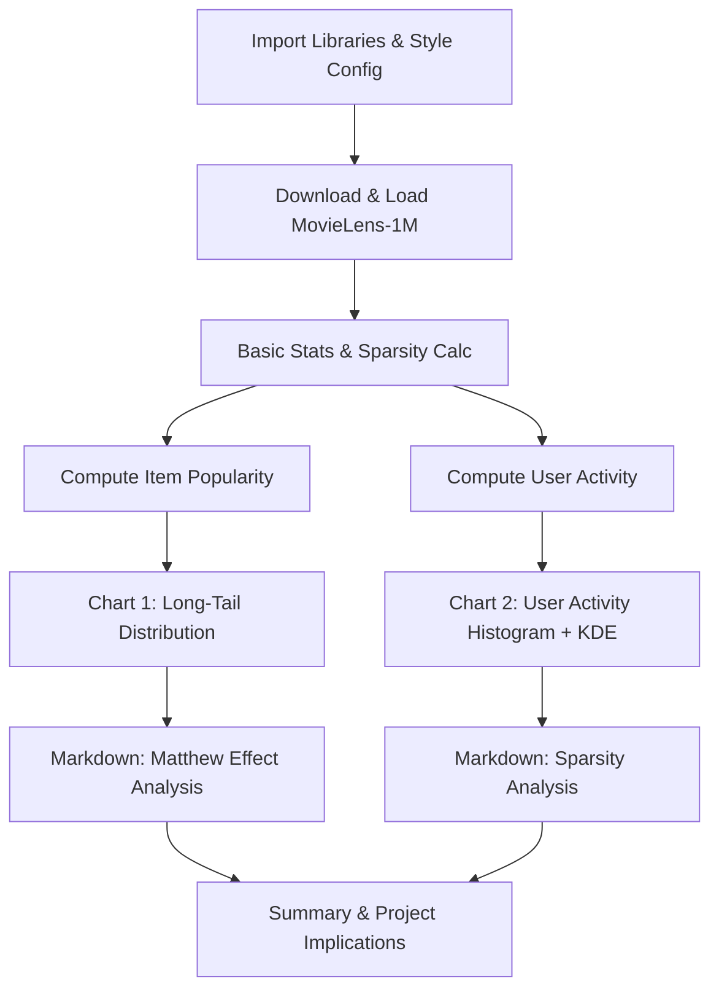

# Phase 1, Step 1: Data Exploration & EDA — Implementation Plan

## Overview

Build a high-quality Jupyter Notebook (`01_data_exploration_and_long_tail.ipynb`) for EDA of the MovieLens-1M dataset, visualizing the Matthew Effect (Long-tail distribution) and user activity sparsity. Charts will be saved as high-DPI images for README display.

---

## 1. Environment Setup

### 1.1 Create Python Virtual Environment

```bash
python3 -m venv venv
source venv/bin/activate
```

### 1.2 Install Dependencies

```bash
pip install --upgrade pip
pip install pandas numpy matplotlib seaborn jupyter requests
```

### 1.3 Create Required Directories

```bash
mkdir -p data/images notebooks
```

---

## 2. Notebook Structure

The notebook will have **4 main sections**, detailed below.

---

### Section 0: Cell Metadata & Imports

**Cell 0.1 — Title & Description (Markdown)**
```markdown
# LLM-RecFusion: Data Exploration & Long-Tail Analysis

**Dataset**: MovieLens-1M (1,000,209 ratings from 6,040 users on 3,952 movies)  
**Objective**: Validate the Matthew Effect and data sparsity, motivating the need for LLM-enhanced semantic retrieval in cold-start/long-tail scenarios.
```

**Cell 0.2 — Imports & Config (Code)**
```python
import pandas as pd
import numpy as np
import matplotlib.pyplot as plt
import seaborn as sns
import requests
import zipfile
import os
from pathlib import Path

# ---------- Global style config ----------
sns.set_theme(
    style="darkgrid",
    context="notebook",
    palette="muted",
    font="DejaVu Sans",
    font_scale=1.1,
)
plt.rcParams.update({
    "figure.dpi": 150,
    "savefig.dpi": 300,
    "savefig.bbox_inches": "tight",
    "font.family": "DejaVu Sans",
    "axes.unicode_minus": False,
})

# Paths
DATA_DIR = Path("data")
RAW_DIR = DATA_DIR / "raw" / "ml-1m"
IMG_DIR = DATA_DIR / "images"
IMG_DIR.mkdir(parents=True, exist_ok=True)
```

---

### Section 1: Data Loading

**Cell 1.1 — Auto-download MovieLens-1M (Code + Markdown)**

Markdown explains the dataset origin and structure.

Code logic:
```python
url = "https://files.grouplens.org/datasets/movielens/ml-1m.zip"
zip_path = DATA_DIR / "ml-1m.zip"
extract_dir = DATA_DIR / "raw"

if not (RAW_DIR / "ratings.dat").exists():
    print("Downloading MovieLens-1M...")
    r = requests.get(url, stream=True)
    with open(zip_path, "wb") as f:
        f.write(r.content)
    with zipfile.ZipFile(zip_path, "r") as z:
        z.extractall(extract_dir)
    zip_path.unlink()
    print("Done.")
else:
    print("Dataset already exists.")
```

**Cell 1.2 — Parse DataFrames (Code)**

Reading with correct separators and column names:

```python
# Rating data: UserID::MovieID::Rating::Timestamp
ratings = pd.read_csv(
    RAW_DIR / "ratings.dat",
    sep="::",
    engine="python",
    names=["user_id", "movie_id", "rating", "timestamp"],
)

# User data: UserID::Gender::Age::Occupation::Zip-code
users = pd.read_csv(
    RAW_DIR / "users.dat",
    sep="::",
    engine="python",
    names=["user_id", "gender", "age", "occupation", "zip_code"],
)

# Movie data: MovieID::Title::Genres
movies = pd.read_csv(
    RAW_DIR / "movies.dat",
    sep="::",
    engine="python",
    names=["movie_id", "title", "genres"],
    encoding="latin-1",
)
```

**Cell 1.3 — Quick Stats (Markdown + Code)**

Show basic statistics: number of ratings, users, movies, sparsity percentage.

Sparsity formula: `1 - n_ratings / (n_users * n_movies)`

---

### Section 2: Chart 1 — Long-Tail Distribution of Item Popularity (Matthew Effect)

**Cell 2.1 — Compute Item Popularity (Code)**

```python
item_pop = ratings["movie_id"].value_counts().reset_index()
item_pop.columns = ["movie_id", "rating_count"]
item_pop = item_pop.sort_values("rating_count", ascending=False).reset_index(drop=True)
item_pop["rank"] = range(1, len(item_pop) + 1)
```

**Cell 2.2 — Draw Long-Tail Chart (Code)**

Design specification:
- **Chart type**: Smooth filled area + line chart
- **Color palette**: Dark, geek/professional theme (`"rocket"` or `"mako"` from seaborn, or a custom dark gradient)
- **Head/Tail demarcation**:
  - Find the "elbow" point using cumulative percentage (e.g., top 20% items or empirical knee)
  - Add a **vertical dashed line** (e.g., `plt.axvline`) at the head-tail boundary
  - Add **text annotations** ("🔥 Head: High-frequency items" / "🧊 Tail: Long-tail cold items")
- **Twin axis**: Left axis = absolute rating count, Right axis = cumulative percentage (Pareto line)
- **Include a "Pareto annotation"**: e.g., "Top 20% items account for ~80% of ratings"

```python
fig, ax1 = plt.subplots(figsize=(14, 7))

# Main fill + line
ax1.fill_between(item_pop["rank"], item_pop["rating_count"], alpha=0.4, color="#2b5f8a")
ax1.plot(item_pop["rank"], item_pop["rating_count"], linewidth=1.5, color="#1a3a5c")

# Pareto cumulative
cumsum = item_pop["rating_count"].cumsum() / item_pop["rating_count"].sum()
ax2 = ax1.twinx()
ax2.plot(item_pop["rank"], cumsum, color="#d62728", linewidth=2, linestyle="--", label="Cumulative %")

# Head-tail boundary (e.g., top 20%)
head_threshold = int(len(item_pop) * 0.2)
ax1.axvline(x=head_threshold, color="orange", linestyle="--", linewidth=2, alpha=0.8)
ax1.text(head_threshold * 0.3, ax1.get_ylim()[1] * 0.9, "🔥 Head\nHot Items", fontsize=12, ...)
ax1.text(head_threshold * 1.5, ax1.get_ylim()[1] * 0.2, "🧊 Long Tail\nCold Items", fontsize=12, ...)

ax1.set_xlabel("Movie Rank (sorted by popularity)", fontsize=13)
ax1.set_ylabel("Number of Ratings", fontsize=13)
ax2.set_ylabel("Cumulative %", fontsize=13)
plt.title("Matthew Effect in Recommendation: Long-Tail Distribution of Item Popularity", ...)
fig.savefig(IMG_DIR / "long_tail_distribution.png", dpi=300)
plt.show()
```

**Cell 2.3 — Analysis Insight (Markdown)**

Explain the Matthew Effect in recommendation. State clearly that:
> "Traditional ItemCF or coarse-ranking models will fail in the long-tail region due to extreme feature sparsity. Therefore, introducing LLM-powered semantic retrieval is the key breakthrough in this project."

---

### Section 3: Chart 2 — User Activity Distribution (Sparsity)

**Cell 3.1 — Compute User Activity (Code)**

```python
user_activity = ratings["user_id"].value_counts().reset_index()
user_activity.columns = ["user_id", "rating_count"]
```

**Cell 3.2 — Draw Histogram + KDE (Code)**

Design specification:
- **Chart type**: Histogram (bars) with overlaid KDE curve
- **Color**: Use seaborn's `"crest"` or a muted blue palette
- **Annotations**: Add vertical lines for mean and median
  - `plt.axvline(mean, color="red", linestyle="--", label=f"Mean: {mean:.1f}")`
  - `plt.axvline(median, color="green", linestyle=":", label=f"Median: {median:.1f}")`
- **X-axis label**: "Number of Ratings per User"
- **Y-axis label**: "Number of Users (Frequency)"
- **Title**: "User Activity Distribution — Evidence of Data Sparsity"
- **Inset text**: Show statistical summary (e.g., mean, median, % of users with <50 ratings)

```python
fig, ax = plt.subplots(figsize=(14, 7))
sns.histplot(user_activity["rating_count"], bins=80, kde=True,
             color="#2b5f8a", edgecolor="white", alpha=0.7, ax=ax)

mean_val = user_activity["rating_count"].mean()
median_val = user_activity["rating_count"].median()
ax.axvline(mean_val, color="#d62728", ls="--", lw=2, label=f"Mean = {mean_val:.1f}")
ax.axvline(median_val, color="#2ca02c", ls=":", lw=2, label=f"Median = {median_val:.1f}")

# Annotate sparsity
sparsity_pct = (user_activity["rating_count"] < 50).mean() * 100
ax.text(0.95, 0.95, f"Users with <50 ratings: {sparsity_pct:.1f}%",
        transform=ax.transAxes, ...)
```

**Cell 3.3 — Analysis Insight (Markdown)**

Explain that most users have extremely sparse behavior histories, making traditional collaborative filtering approaches unreliable. This justifies subsequent stages of the project: data augmentation, sequence masking, and LLM-based cold-start recommendations.

---

### Section 4: Summary Markdown Block

A final markdown cell that succinctly summarizes the two key findings:
1. **Matthew Effect / Long Tail**: A small fraction of items dominate interactions, while most items suffer from extreme data sparsity.
2. **User Sparsity**: The majority of users have very few recorded interactions, limiting the effectiveness of traditional CF/ID-based methods.
3. **Project Implications**: These findings directly motivate the use of LLM-enhanced semantic representations to bridge the gap for long-tail and cold-start items/users.

---

## 3. File Output Summary

| File | Description |
|---|---|
| `notebooks/01_data_exploration_and_long_tail.ipynb` | Complete EDA notebook |
| `data/images/long_tail_distribution.png` | Chart 1: Long-tail distribution (300 DPI) |
| `data/images/user_activity_distribution.png` | Chart 2: User activity histogram (300 DPI) |

---

## 4. Design Guidelines

- **Color palette**: Dark, professional, geek aesthetic. Use seaborn darkgrid + custom muted blues/teals.
- **Fonts**: `DejaVu Sans` (widely available, clean). Title font size ~16, axis labels ~13.
- **DPI**: Display 150, Save 300.
- **File format**: PNG with tight bounding box.
- **Annotations**: Every chart must have clear text labels explaining the Matthew Effect and sparsity.

---

## 5. Code Mode Implementation Steps

1. `cd /home/hjy/Videos/LLM-REC`
2. Run environment setup commands (venv + pip install)
3. Run `mkdir -p data/images notebooks`
4. Create the Jupyter Notebook file at `notebooks/01_data_exploration_and_long_tail.ipynb`
5. Validate: start jupyter and run all cells
6. Verify images are saved to `data/images/`

---

## 6. Mermaid Diagram: Notebook Workflow


